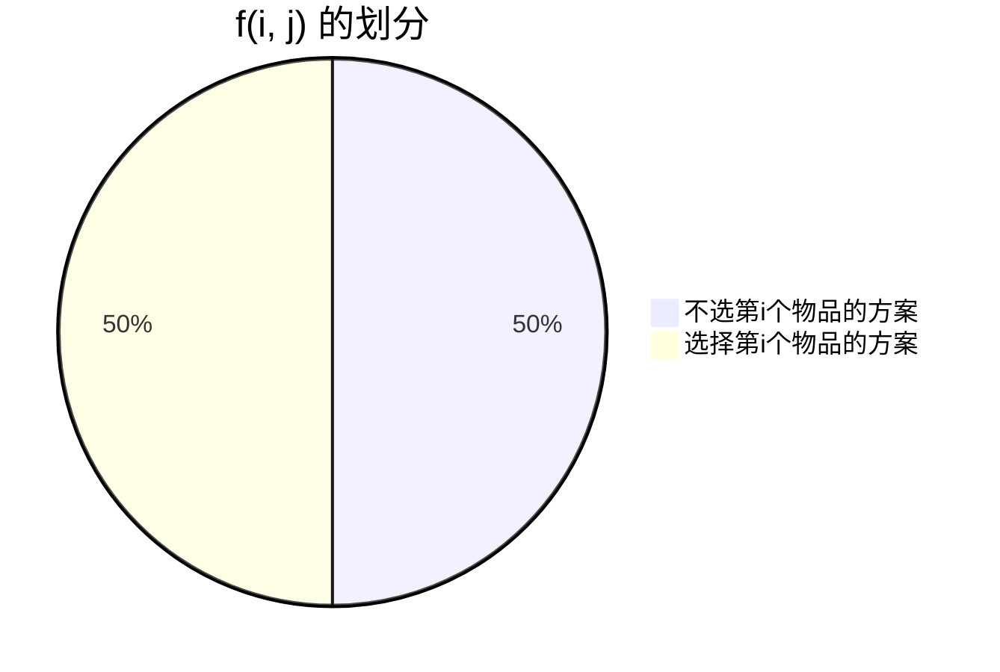

# 背包问题

## 0-1背包问题

### 闫氏DP分析法

#### 1. 状态表示

- 对于选择问题的状态表示，比较相似
  - 第一维度：只考虑前i个物体
  - 后几个维度，一般都是**限制**
- 对于0-1背包问题 f(i, j)一般从两个角度来考虑：表示的集合是什么？存值的属性和整个集合的属性是什么
  - 集合：所有只考虑前i个物品，并且总体积不超过j（**每个维度对应一个条件**）
  - 属性：MAX(考虑的是最大价值)

#### 2. 状态计算



- 将f(i, j)划分为两个集合（满足两个原则**不重复，不遗漏**）
  - 左边集合为所有不选第i个物品的方案
  - 右边集合为所有选择第i个物品的方案
  - **只需要对上面这两个集合的最大值去最大值，就是f(i, j)的最大值**
- 对于左边集合：
  - 最大值为**f(i-1, j)**
- 对于右边集合：
  - 将集合分为两部分，**变与不变**。在这个集合中，每个方案肯定都选择了第i个物品，这是不变的部分；而1~ i - 1部分中，这部分是变化的
  - 变的部分为前$i-1$个物品，这部分加上第i个物品的体积需要小于等于j
  - 不变的部分第i个物品，体积为v\[i\]
  - 综上所述，右边集合的最大值为**f(i - 1, j - v\[i\]) + w\[i\]**
- 最后得出的最大值就应为**max(f(i-1, j),f(i - 1, j - v\[i\]) + w\[i\])**

### 代码模版

#### 朴素版本

```c++
#include <bits/stdc++.h>

using namespace std;

const int N = 1010;

int n, m;
int v[N], w[N];
int f[N][N];

int main(void){

    cin >> n >> m;
    for(int i = 1; i <= n; i ++){
        cin >> v[i] >> w[i];
    }

    for(int i = 1; i <= n; i ++){
        for(int j = 1; j <= m; j ++){
            f[i][j] = f[i - 1][j];
            if(j >= v[i])
                f[i][j] = max(f[i][j],f[i - 1][j - v[i]] + w[i]);
        }
    }

    cout << f[n][m] << endl;

    return 0;
}
```

#### 优化版本

##### 对于优化版本的理解

- dp所有代码都是对朴素版本的代码做等价变形
- 对于状态转移代码的第一行 `f[i][j] = f[i - 1][j];`我们可以将其化简为`f[j] = f[j]`；当我们对新一层的`f[j]`做更新时，简化后右侧的`f[j]`其实是前一层的的，还没做更新。综上，`f[i][j] = f[i - 1][j]`与`f[j] = f[j]`，进一步地`f[j] = f[j]`是恒等式，所以此行可以删去
- 对于状态转移代码的第二部分`f[i][j] = f[i - 1][j - v[i]] + w[i]`
  - 首先，我们粗暴地将其转化为一维并进行表示`f[j] = f[j - v[i]] + w[i]`
  - 其次，结合循环语句`for(int j = 0; j <= m; j++)`可以得知，当我们对`f[j]`进行更新的时候，`f[j - v[i]]`已经被计算出来的，即对应的是`f[i][j - v[i]]`，**这显然是与原方程不符的**
  - 那么，我们对循环条件进行修改，改为`for(int j = m; j >= 0; j --)`，进行从大到小循环，那么对`f[j]`进行更新时，对应的本层的`f[j - v[i]]`还未被计算（更新），所以`f[j - v[i]]`对应的是`f[i - 1][j - v[i]]`
  - 并且原代码块中`if(j >= v[i])`也可以并入`for`循环中，最终改为`for(int j = m; j >= v[i]; j --)`
  - 最后，更改了循环方式之后，状态转移代码的第二部分优化完成
- 完整的优化后代码如下所示

##### 代码实现

```c++
#include <bits/stdc++.h>

using namespace std;
const int N = 1100;
int n, m;
int f[N], v[N], w[N];


int main(void){

    ios::sync_with_stdio(false), cin.tie(0), cout.tie(0);

    cin >> n >> m;

    for(int i = 0; i < n; i ++){
        cin >> v[i] >> w[i];
    }

    for(int i = 0; i < n; i ++){
        for(int j = m; j >= v[i]; j --){
            f[j] = max(f[j], f[j - v[i]] + w[i]);
        }
    }

    cout << f[m] << endl;


    return 0;
}
```

## 完全背包问题

- 区别于0-1背包问题，完全背包问题中的每个物品可以用无限次

### 状态表示

- f(i, j)表示的哪个集合
- f(i, j)存储的值是集合的哪种属性

#### 集合

- 只从前i个物品中选
- 总体积不超过j的方案的集合

### 状态计算

- 将集合划分为若干个子集
  - 第一个子集为**选0个第i个物品放在背包里面**
  - 第二个子集为**选1个第i个物品放在背包里面**
  - 第三个子集为**选2个第i个物品放在背包里面**
  - ……
  - 第$k+1$个子集为**选k个第i个物品放在背包里面**
  - ……
- 那么每个子集就可以表示为
  - 第一个子集表示为**f(i - 1, j)**
  - 第$k+1$个子集表示为**f(i - 1, j - k \* v\[i\]) + k w\[i\]**
    - 将这个子集划分为两个部分
- 最后，f(i, j)可以表示为$$f(i,j)=\max(f(i-1,j),f(i-1,j-v_i)+w_i,f(i-1,j-2*v_i)+2*w_i,...)$$
- 将$j=j-v_i$带入$f(i,j)$中$$f(i,j-v_i)=\max(f(i-1,j-v_i),f(i-1,j-2v_i)+w_i,f(i-1,j-3*v_i)+2*w_i,...)$$
- 所以，完全背包问题的f(i, j)可以表示为$$f(i,j)=\max(f(i-1,j),f(i,j-v_i)+w_i)$$

### 代码实现

#### 朴素版本

```c++
#include <bits/stdc++.h>

using namespace std;

const int N = 1100;
int n, m;
int v[N], w[N];
int f[N][N];


int main(void){

    ios::sync_with_stdio(false),cin.tie(0), cout.tie(0);

    cin >> n >> m;
    for(int i = 1; i <= n; i ++){
        cin >> v[i] >> w[i];
    }

    for(int i = 1; i <= n; i ++){
        for(int j = 1; j <= m; j++){
            f[i][j] = f[i - 1][j];

            if(v[i] <= j)
            // 注意这里的等号！！
                f[i][j] = max(f[i][j], f[i][j - v[i]] + w[i]);


        }
    }


    cout << f[n][m] << endl;
    return 0;
}
```

#### 优化版本

```c++
#include <bits/stdc++.h>

using namespace std;

const int N = 1100;
int n, m;
int f[N], w[N], v[N];

int main(){
    ios::sync_with_stdio(false), cin.tie(0), cout.tie(0);

    cin >> n >> m;

    for(int i = 0; i < n; i ++){
        cin >> v[i] >> w[i];
    }

    for(int i = 0; i < n; i ++){
        for(int j = v[i]; j <= m; j ++){
            f[j] = max(f[j], f[j- v[i]] + w[i]);
        }
    }


    cout << f[m] << endl;
    return 0;
}
```

## 多重背包问题

- 多重背包问题主要在于状态表示方程又多了一个维度
- 每个物品的数量又有了限制
  - 这区别于0-1背包和完全背包（虽然他们说这个0-1背包的扩展，但是还是等我沉淀一下再去理解这个“扩展”的意思是什么吧
  - 0-1背包中每个物品只可以用1遍
  - 完全背包中每个物品可以用无数遍
  - 而多重背包问题每个物品有限定的个数，例如5个，7个

### 代码实现

```c++
#include <bits/stdc++.h>
using namespace std;

const int N = 110;
int n, m;
int f[N];

int main(void){

	cin >> n >> m;

	for(int i = 1; i <= n; i++){

		int v, w, s;
		cin >> v >> w >> s;

		for(int j = m; j >= v; j --){
			for(int k = 0; k <= s && k * v <= j; k++){
				f[j] = max(f[j], f[j - k * v] + k * w);
			}
		}
	}

	cout << f[m] << endl;


	return 0;
}
```

## 多重背包问题II

- 当数据变得很大之后，单纯使用三层循环会超时
- 所以我们使用二进制来优化
  - 例如：$10$可以用$1, 2, 4, 3$来表示
  - 这个$3$是用$10-1-2-4$算出来的
  - 因为$1, 2, 4$可以表示0~7，加上一个3之后，就可以表示3~10，同时0~2也可以表示，综上0~10是都可以表示的
  - 所以一个数$n$可以拆分为用$log_2(n)$个2的整数次幂数（最后一个数可能不是2的整数次幂数）表示

```c++
#include <bits/stdc++.h>

using namespace std;

const int N = 2010;

int n, m;
int f[N];

struct Good{
    int v, w;
};

int main()
{
    cin >> n >> m;
    vector<Good> goods;
    for(int i = 0; i < n; i ++){
        int v, w, s;
        cin >> v >> w >> s;
        for(int k = 1; k <= s; k *= 2){
            // 注意这里的取等条件，不要忘记啦，这里还是需要弄明白
            goods.push_back({v * k, w * k});
            s -= k;
        }
        if(s > 0)
            goods.push_back({v * s, w * s});
    }


    for(auto good: goods){
        for(int j = m; j >= good.v; j --){
            f[j] = max(f[j], f[j - good.v] + good.w);
        }
    }

    cout << f[m] << endl;

    return 0;
}
```

## 分组背包问题

### 主要思路

- 给n组物品，容量是v的背包，每组物品有若干个，同一组物品最多只能选1个物品
- 在上面这种情况下，把哪些物品装进背包，并且价值最大
- 对于每一组物品，若这个组中包含s个物品，那么就有s + 1中决策
  - 不选这组中的任何物品
  - 选这组中的第1个物品
  - 选这组中的第2个物品
  - ……

### 实现代码

```c++
#include <bits/stdc++.h>

using namespace std;

const int N = 110;
int n, m;
int f[N], v[N], w[N];


int main(void){

    ios::sync_with_stdio(false), cin.tie(0), cout.tie(0);

    cin >> n >> m;
    for(int i = 0; i < n; i ++){

        int s;
        cin >> s;
        for(int j = 0; j < s; j ++){
            cin >> v[j] >> w[j];
        }

        for(int j = m; j >= 0; j --){
            for(int k = 0; k < s; k++){
                if(j >= v[k]){
                    f[j] = max(f[j], f[j - v[k]] + w[k]);
                }
            }
        }


    }


    cout << f[m] << endl;

    return 0;
}
```

# 线性DP

## 最长上升子序列

<div class="row">
    <div class="col-sm mt-3 mt-md-0">
        
    </div>
</div>

### 解题思路

- 动态规划：
  - 状态表示：`f[i]`表示以第`i`个数字为结尾的最大长度
    - 集合：所以以第`i`个数结尾的上升子序列
    - 属性：集合里面每一个上升子序列的长度的**最大值**
  - 状态计算：将`f[i]`集合进行分类，以倒数第二个数的位置进行分类
    1.  序列中只有一个数
    2.  倒数第二个数是序列的第$1$个数
    3.  倒数第二个数是序列的第$2$个数
    4.  ……
    5.  倒数第二个数是序列的第$i-1$个数
    - 公式：$f(i)=max(f(j) + 1),j=0,1,2,3,...,i-1,a$

### 实现代码

```cpp
#include <bits/stdc++.h>
using namespace std;

const int N = 1100;

int n;
int a[N], f[N];


int main(){

    scanf("%d", &n);

    for(int i = 1; i <= n; i ++)
        scanf("%d", &a[i]);


    for(int i = 1; i <= n; i ++){
        f[i] = 1;
        // 只有a[i]一个数
        for(int j = 1; j < i; j ++)
            if(a[j] < a[i])
                f[i] = max(f[i], f[j] + 1);
    }

    int res = 0;
    for(int i = 1; i <= n; i ++){
        res = max(res, f[i]);
    }

    cout << res << endl;


    return 0;
}

```

## 最长上升子序列II

<div class="row">
    <div class="col-sm mt-3 mt-md-0">
        
    </div>
</div>

### 知识点

### 解题思路

- 某一元素前，存储所有不同长度的上升子序列的最后一个元素的最小值

<div class="row">
    <div class="col-sm mt-3 mt-md-0">
        
    </div>
</div>

- 如上图所示，所有各种长度的上升子序列的最后元素的最小值排列在一起，应该是严格递增的
- 证明：
  - 假设：长度为6的上升子序列的最后一个元素的最小值为$x$，长度为5的上升子序列的最后一个元素的最小值为$y$，并且$x \leq y$
  - 那么，长度为6的上升子序列的倒数第二个元素$z$一定小于$y$
  - 但是，$z < y$与事实$y$是长度为5的上升子序列的最后一个元素是最小值相违背
  - 所以假设为假，$x > y$为真，整个序列一定是单调递增的

### 实现代码

```cpp
#include <bits/stdc++.h>

using namespace std;

const int N = 1e5 + 100;

int n;
int a[N], q[N];
// a[N]用来存储数字
// q[N]用来存储不同长度的上升子序列的最后一个元素的最小值

int main(){

    ios::sync_with_stdio(false), cin.tie(0), cout.tie(0);

    cin >> n;

    // 存入数组
    for(int i = 1; i <= n; i ++)
        cin >> a[i];


    int len = 0;
    for(int i = 1; i <= n; i ++){
        // 利用二分法，对q[N]进行更新
        int l = 0, r = len;
        while(l < r){
            int mid = l + r + 1 >> 1;
            if(q[mid] < a[i])
                l = mid;
            else
                r = mid - 1;
        }
        // 当前a[i]插入的位置+1（即最后一个数字为a[i]的上升子序列的长度）
        // 和之前算出来的最长上升子序列长度
        // 进行比较并更新最长上升子序列长度
        len = max(len, r + 1);

        // 将a[i]元素插入到对应位置，即更新某一长度的上升子序列的最后一个元素的最小值
        q[r + 1] = a[i];
    }

    // 输出答案
    cout << len << endl;

    return 0;
}

```

## 最长公共子序列

<div class="row">
    <div class="col-sm mt-3 mt-md-0">
        
    </div>
</div>

### 知识点

### 解题思路

- 求A和B所有的公共子序列的长度的最大值
- 动态规划（闫氏DP分析法）
  - 状态表示：`f[i][j]`
    - 集合：所有`A[1] ~ A[i]`和`B[1] ~ B[j]`的公共子序列的集合
    - 属性：最大值
  - 状态计算：通过`a[i]`和`b[j]`字符在不在这个子序列
    - `00`：`a[i]`和`b[j]`都不包含
      - 那么公共子序列应该在`A[1] ~ A[i - 1]`和`B[1] ~ B[j - 1]`中求得
      - 对于这种情况，**`f[i][j] = f[i - 1][j - 1]`**
    - `01`：不包含`a[i]`，只包含`b[j]`
      - **我们可以发现这种情况比较难表示**
      - 因为`f[i - 1][j]`不一定包含`b[j]`，但是在求最大值的过程中，我们重复表示也是无所谓的
      - 因为`f[i - 1][j]`中不包含`b[j]`的情况会被包含在其他情况中，不会影响最大值的计算
      - 对于这种情况，`f[i][j] = f[i - 1][j]`
    - `10`：不包含`b[j]`，只包含`a[i]`
      - **我们可以发现这种情况比较难表示**
      - 因为`f[i][j - 1]`不一定包含`a[i]`，但是在求最大值的过程中，我们重复表示也是无所谓的
      - 因为`f[i][j - 1]`中不包含`a[i]`的情况会被包含在其他情况中，不会影响最大值的计算
      - 对于这种情况，`f[i][j] = f[i][j - 1]`
    - `11`：`a[i]`和`b[j]`都包含
      - 只有`a[i] == b[j]`时，才可能出现这种情况
      - 此时，我们如果不考虑`a[i]`和`b[j]`，那么`A[1] ~ A[i - 1]`和`B[1] ~ B[j - 1]`中的解就是`f[i - 1][j - 1]`
      - 对于这种情况，**`f[i][j] = f[i - 1][j - 1] + 1`**
  - 在这道题中，因为是求最大值，所以重复无所谓，只保证不遗漏就可以
  - 综上，`f[i][j] = max(f[i - 1][j], max(f[i][j - 1], f[i - 1][j - 1] + 1))`

### 实现代码

```cpp
#include <bits/stdc++.h>

using namespace std;
const int N = 1100;

int n, m;
char a[N], b[N];
int f[N][N];

int main(){

    cin >> n >> m >> a + 1 >> b + 1;

    for(int i = 1; i <= n; i ++){
        for(int j = 1; j <= m; j ++){
            f[i][j] = max(f[i - 1][j], f[i][j - 1]);
            if(a[i] == b[j])
                f[i][j] = max(f[i][j], f[i - 1][j - 1] + 1);
        }
    }

    cout << f[n][m] << endl;


    return 0;

}

```

## 最短编辑距离

<div class="row">
    <div class="col-sm mt-3 mt-md-0">
        
    </div>
</div>

### 知识点

### 解题思路

- 动态规划：
  - 状态表示：`f[i, j]`
    - 集合：所有将字符串`A[1 ~ i]`转化为`B[1 ~ j]`的操作方式操作次数
    - 性质：最小值
  - 状态计算：
    - 集合划分：根据最后一步的操作的不同，将集合划分为三类
      - 删除：在删除之前，应该保证字符串`A[1 ~ i - 1]`与`B[1 ~ j]`匹配，此时的操作数就是`f[i - 1, j] + 1`
      - 插入：在插入之前，应该保证`A[1 ~ i]`和`B[1 ~ j - 1]`匹配，此时的操作数就是`f[i, j - 1] + 1`
      - 替换：在进行替换之前，应该保证`A[1 ~ i - 1]`和`B[1 ~ j - 1]`匹配
        - 如果`A[i] == B[j]`，那么操作数为`f[i - 1, j - 1] + 1`
        - 如果`A[i] != B[j]`，那么操作数为`f[i - 1, j - 1]`

### 实现代码

```cpp

#include <bits/stdc++.h>
using namespace std;
const int N = 1010;

char a[N], b[N];
int n, m;
int f[N][N];

int main(){
    scanf("%d%s", &n, a + 1);
    scanf("%d%s", &m , b + 1);

    for(int i = 0; i <= n; i ++)
        f[i][0] = i;

    for(int i = 0; i <= m; i ++)
        f[0][i] = i;


    for(int i = 1; i <= n; i ++){
        for(int j = 1; j <= m; j ++){
            f[i][j] = min(f[i - 1][j] + 1, f[i][j - 1] + 1);
            if(a[i] == b[j])
                f[i][j] = min(f[i][j], f[i - 1][j - 1]);
            else
                f[i][j] = min(f[i][j], f[i - 1][j - 1] + 1);
        }
    }

    printf("%d", f[n][m]);
    return 0;
}

```

## 编辑距离

### 实现代码

```cpp
#include <bits/stdc++.h>
using namespace std;
const int N = 15, M = 1010;

int f[N][N];
char str[M][N];

int n, m;


int edit_distance(char a[], char b[]){
    int la = strlen(a + 1), lb = strlen(b + 1);
    for(int i = 0; i <= lb; i ++)
        f[0][i] = i;

    for(int i = 0; i <= la; i ++)
        f[i][0] = i;


    for(int i = 1; i <= la; i ++){
        for(int j = 1; j <= lb; j ++){
            f[i][j] = min(f[i - 1][j] + 1, f[i][j - 1] + 1);
            f[i][j] = min(f[i][j], f[i - 1][j - 1] + (a[i] != b[j]));
        }
    }

    return f[la][lb];
}

int main(){
    cin >> n >> m;
    for(int i = 0; i < n; i ++)
        scanf("%s", str[i] + 1);

    while(m --){
        int limit;
        char s[N];
        scanf("%s%d", s + 1, &limit);
        int res = 0;
        for(int i = 0; i < n; i ++){
            if(edit_distance(str[i], s) <= limit)
                res ++;
        }

        // cout << res << endl;
        printf("%d\n", res);

    }

    return 0;
}
```

# 区间DP

## 石子合并

<div class="row">
    <div class="col-sm mt-3 mt-md-0">
        
    </div>
</div>

### 知识点

### 解题思路

- 动态规划
- 闫氏DP分析法
  - 状态表示：`f[i][j]`
    - 集合：所有将$[i, j]$合并为一堆的方案的集合
    - 属性：最小值
  - 状态计算：根据分析可知，最后合并的一定是**左面一堆右面一堆**，所以按照划分的地方进行区分
    - 对于左面一堆：需要合并的最小代价为`f[i, k]`
    - 对于右面一堆：需要合并的最小代价为`f[k + 1, j]`
    - 合并两个大堆所需要的代价是$\sum_{m = i}^ja_m$，可以优化为使用区间和进行表示，即`s[j] - s[i - 1]`
- 状态转移方程为：$f(i,j)=f(i,k)+f(k+1, j)+s[j]-s[i-1]$

<div class="row">
    <div class="col-sm mt-3 mt-md-0">
        
    </div>
</div>

### 实现代码

```cpp

#include <bits/stdc++.h>

using namespace std;
const int N = 330;

int f[N][N];
int s[N];
int n;


int main(){
    cin >> n;
    for(int i = 1; i <= n; i ++)
        cin >> s[i], s[i] += s[i - 1];


    for(int len = 2; len <= n; len ++){
        for(int i = 1; i + len - 1 <= n; i ++){
            int j = i + len - 1;
            f[i][j] = 1e9;
            for(int k = i; k < j; k ++)
                f[i][j] = min(f[i][j], f[i][k] + f[k + 1][j] + s[j] - s[i - 1]);
        }
    }

    cout << f[1][n] << endl;
    return 0;
}

```

# 计数类DP

## 整数划分

<div class="row">
    <div class="col-sm mt-3 mt-md-0">
        
    </div>
</div>

### 知识点

### 解题思路

- 闫氏DP分析法
  - 状态表示：`f[i][j]`
    - 集合：表示从第1个数到第`i`个数，我们选出的数的和为`j`的方案数
    - 属性：数量
  - 状态计算：划分集合
    - 根据最后一个物品选择了几个进行划分
    - 选了`0`个：`f[i][j] = f[i - 1][j]`
    - 选了`1`个：`f[j][j] = f[i - 1][j - v]`
    - ……
    - 选了`s`个：`f[i][j] = f[i - 1][j - s * v]`

```cpp
f[i][j] = f[i - 1][j] + f[i - 1][j - i] + ... + f[i - 1][j - i * s]
f[i][j - i] =           f[i - 1][j - i] + ... + f[i - 1][j - i * s]

f[i][j] = f[i - 1][j] + f[i - 1][j - i]

f[j] = f[j] + f[j - i]
```

### 实现代码

```cpp
#include <bits/stdc++.h>
using namespace std;

const int N = 1100, mod = 1e9 + 7;
int f[N];

int main(){
    int n;
    cin >> n;
    f[0] = 1;
    // f[i][0] = 1;
    // f[i][1] = f[i - 1][j] + f[i - 1][j - 1] = f[i - 1][1] + f[i - 1][0]
    // f[1][1] = f[0][1] + f[0][0] = 1

    for(int i = 1; i <= n; i ++){
        for(int j = 1; j <= n; j ++){
            f[j] = (f[j] + f[j - i]) % mod;
        }
    }

    cout << f[n] << endl;

    return 0;
}

```

# 数位统计DP

## 计数问题

<div class="row">
    <div class="col-sm mt-3 mt-md-0">
        
    </div>
</div>

### 知识点

### 解题思路

- 分情况讨论
- 我们要找出区间`[a ,b]`之间`0~9`的个数
  - 设`count(n, x)`为区间`[1, n]`中`x`出现的次数
  - 求`count(b, x) - count(a - 1, x)`
- 假设第`n`个数为`abcdefg`，分别求出1在每一位上出现的次数
  - 例如：求1在第4位上出现的次数
  - `1 <= xxx1yyy <= abcdefg`
    - `xxx = 000 ~ abc - 1, yyy = 000 ~ 999`，共有`abc * 1000`中情况
    - `xxx = abc`
      - 如果`d < 1`，那么`abc1yyy > abc0efg`，这种方案的数目就是0
      - 如果`d = 1`，那么`yyy = 000 ~ efg`，这种方案的数目就是`efg + 1`
      - 如果`d > 1`，那么`yyy = 000 ~ 999`，其实就是`1000 ~ 1999`，共有`1000`种

### 实现代码

```cpp
#include <bits/stdc++.h>
using namespace std;

const int N = 20;

int pow10(int x){
    int res = 1;
    while(x --)
        res *= 10;

    return res;
}


int get(vector<int> num, int l, int r){
    int res = 0;
    for(int i = l; i >= r; i --)
        res = res * 10 + num[i];


    return res;
}


int count(int n, int x){
    if(!n)
        return 0;


    // 用来存储数字中的每一位
    vector<int> num;

    // num表示传入的数字

    while(n){
        num.push_back(n % 10);
        n /= 10;
    }

    n = num.size();

    int res  = 0;

    for(int i = n - 1 - !x; i >= 0; i --){
        // 当xxx位于0 ~ abc - 1中时
        if(i < n - 1){
            // 这个情况一定会经历
            res += get(num, n - 1, i + 1) * pow10(i);
            if(!x)
                res -= pow10(i);
        }

        if(num[i] == x)
            res += get(num, i - 1, 0) + 1;
        else if(num[i] > x)
            res += pow10(i);

    }

    return res;

}


int main(){
    int a, b;
    while(cin >> a >> b, a){
        if(a > b)
            swap(a, b);

        for(int i = 0; i < 10; i ++)
            printf("%d ", count(b, i) - count(a - 1, i));

        cout << endl;
    }
}
```

# 状态压缩DP

## [蒙德里安的梦想](https://www.acwing.com/problem/content/293/)

### 知识点

### 解题思路

- 核心：先放横着的，再放竖着的
- 总方案数等于只放横着的小方块的合法方案数
- 判断当前方案是否合法的方法
  - 判断横着小方块剩余的地方能否用竖着的小方块填满
  - 可以按列来看，每一列内部所有连续的空着的小方块，如果是偶数个，那么就可以填满
- 动态规划：
  - 状态表示：`f[i][j]`，其中`i`用十进制数表示；`j`用二进制数表示，但是用十进制数来存储
    - 集合：`f[i][j]`表示已经将前`i-1`列摆好，且从第`i-1`列，伸出第`i`列
    - 性质：
  - 状态计算：
    - 按照第`i-1`列伸到第`i`列的状态划分集合，可以有$2^n$种
    - 考虑`f[i-1][k]`和`f[i][j]`能否拼接成为一个合法的方案？
      - 两个方案在同一行上不能有冲突，即`j & k == 0`
      - 所有连续空着的位置的长度必须是偶数
  - 最后答案就是`f[m][0]`

<div class="row">
    <div class="col-sm mt-3 mt-md-0">
        
    </div>
</div>

### 实现代码

- 先对数据进行预处理，首先判断状态`k`能不能转移到状态`j`

```cpp
#include <bits/stdc++.h>
using namespace std;
typedef long long LL;
const int N = 12, M = 1 << N;

// f[i][j]的含义是
// 前i-1列已经安排好，不会再动
// j用一个二进制数来存储第i-1列中排列的方块突出到第i列的分布
// 例如：j = 10101可以表示第i-1列中的第一、三、五行突出到了第i列
// 摆放时候先横着摆，再竖着摆
// 总方案数等于只横着放的矩形方块的合法方案数
LL f[N][M];
int n, m;
bool st[M];
vector<int> state[M];


int main(){
    while(cin >> n >> m, n || m){
        for(int i = 0; i < 1 << n; i ++){
            // 用来初始化st数组
            // st数组用来存储当前该列中某种1的排列是否合法
            int cnt = 0;
            bool is_valid = true;
            for(int j = 0; j < n; j ++){
                if(i >> j & 1){
                    // 表示该位为1
                    if(cnt & 1){
                        // 之前的零有奇数个
                        is_valid = false;
                        break;
                    }
                    cnt = 0;
                }
                else
                    cnt ++;
            }

            if(cnt & 1)
                is_valid = false;

            st[i] = is_valid;
        }

        for(int i = 0; i < 1 << n; i ++){
            // 将所有可以转移的状态存入数组中
            // 对于第i列的所有状态，看似枚举的是第i列的状态，但其实主角是第i-1列
            // 我们要找到所有位于第i-1列能够转移到第i列的合法状态
            state[i].clear();
            // 对于第i-1列的所有状态，我们还要判断第i-2列突出的部分
            // 如果第i-1突出的部分和第i-2列突出的部分不重叠
            // 并且第i-1列和第i-2列合并之后的1分布对应在st数组也是合法的
            // 那么就说对于第i列的状态i，是可以由第i-1列状态j转移过来的
            for(int j = 0; j < 1 << n; j ++)
                if((i & j) == 0 && st[i | j])
                    state[i].push_back(j);
        }

        memset(f, 0, sizeof f);

        // 表示第0列什么都不放的方案数只有1
        // 范围其实是0 ~ m - 1
        f[0][0] = 1;
        for(int i = 1; i <= m; i ++){
            // 用来遍历m列
            for(int j = 0; j < 1 << n; j ++){
                // 判断每种1的分布可以由哪种前一列的合法分布k转化过来
                for(auto k: state[j])
                    f[i][j] += f[i - 1][k];
            }
        }

        cout << f[m][0] << endl;

    }

    return 0;
}
```

## 最短Hamilton路径

<div class="row">
    <div class="col-sm mt-3 mt-md-0">
        
    </div>
</div>

### 知识点

- 位运算的优先级低于加减法运算

### 解题思路

- 给定4个点`0, 1, 2, 3`
  - 那么可能存在的路径为：
  - `0 -> 1 -> 2 -> 3`
  - `0 -> 2 -> 1 -> 3`
  - `...`
- 其实不关心每个点的遍历顺序，只关心每个点被使用过没，并且当前停在哪个点上
  - 哪些点被用过？
  - 目前停在哪个点上
- 时间复杂度分析
  - 哪些点被用过：分析可得，一共有$2^{20}$种情况，情况使用**状态压缩**后用二进制数进行表示，例如：
    - 使用了`0, 1, 4`这几个点
    - 可以使用二进制数`10011`表示，从右往左看，最右侧第一位是0
  - 目前停在哪个点上：一共有20个点
  - 最大操作数为：$2^{20}\times 20 \approx 2\times 10^7$。**可以接受！**
- 转移方程：`f[state][j] = f[state][k] + weight[k][j]`
  - `f[i][j]`的值为当前距离
  - `state_k = state_{除掉j之后的集合}`
  - `state_k`要包含`k`

### 实现代码

```cpp
#include <bits/stdc++.h>
using namespace std;
const int N = 20, M = 1 << N;
int f[M][N], weight[N][N];

int n;
int main(){
    cin >> n;
    for(int i = 0; i < n; i ++)
        for(int j = 0; j < n; j ++)
            scanf("%d",&weight[i][j]);
    // 如果求最大值，可以初始化为-1
    // 如果求最小值，可以初始化为0x3f
    memset(f, 0x3f, sizeof f);
    // 表示从已经走了第0点，然后终点为0点的路径长度为0
    f[1][0] = 0;


    for(int i = 0; i < 1 << n; i ++){
        // 第一层循环遍历每个状态
        for(int j = 0; j < n; j ++){
            // 第二层循环遍历终点时哪个点
            if(i >> j & 1){
                // 如果当前状态第j位为1
                // 说明可以走到j点
                for(int k = 0; k < n; k ++){
                    // 接下来判断这个状态中有没有k
                    // 判断时，由于还没有走到第j位
                    // 所以减去第j位
                    // 然后判断第k位是不是1
                    if(i - (1 << j) >> k & 1)
                        f[i][j] = min(f[i][j], f[i - (1 << j)][k] + weight[k][j]);
                }
            }
        }
    }
    cout << f[(1 << n) - 1][n - 1] << endl;
    return 0;

}

```

# 树形DP

## 没有上司的舞会

<div class="row">
    <div class="col-sm mt-3 mt-md-0">
        
    </div>
</div>

### 知识点

### 解题思路

- 闫氏DP分析法：
  - 状态表示：`f[u][i]`
    - 集合：
      - `f[u][0]`：所有从以`u`为根的子树中选择的方案，并且**不选**`u`这个点的方案
      - `f[u][1]`：所有从以`u`为根的子树中选择的方案，并且**选择**`u`这个点的方案
    - 属性：最大值
  - 状态计算：
    - `f[u][0]`表示不选`u`节点的该子树的最大值，那么对于该节点的每个子节点，我们既可以选也可以不选；为了求出最大值，我们要求每个以子节点为根节点的数都是最大值。所以，更新`f[u][0]`的方式为`f[u][0] += max(f[s][0], f[s][1])`
    - `f[u][1]`表示选`u`节点为该子树的最大值，那么这个根节点的子节点都不能选择了。所以，更新`f[u][1]`的方式为`f[u][1] += f[s][0]`
    - 其中`s`表示每个子节点，需要遍历累加

### 实现代码

```cpp
#include <bits/stdc++.h>
using namespace std;

const int N = 6010;

int h[N], e[N], ne[N], idx;
int happy[N];
bool has_fa[N];
int n;
int f[N][2];

void add(int a, int b){
    e[idx] = b, ne[idx] = h[a], h[a] = idx ++;
}

void dfs(int u){
    f[u][1] += happy[u];

    for(int i = h[u]; i != -1; i = ne[i]){
        int j = e[i];
        dfs(j);

        f[u][1] += f[j][0];
        f[u][0] += max(f[j][1], f[j][0]);
    }
}

int main(){
    cin >> n;
    memset(h, -1,sizeof h);
    for(int i = 1; i <= n; i ++)
        scanf("%d", &happy[i]);

    for(int i = 1; i <= n - 1; i ++){
        int l, k;
        scanf("%d%d", &l, &k);
        add(k, l);
        has_fa[l] = true;
    }

    int root = 1;
    while(has_fa[root])
        root ++;


    dfs(root);
    cout << max(f[root][0], f[root][1]) << endl;
    return 0;
}


```

# 记忆化搜索

## 滑雪

<div class="row">
    <div class="col-sm mt-3 mt-md-0">
        
    </div>
</div>

### 知识点

### 解题思路

- 闫氏DP分析法：
  - 状态表示：`f[i][j]`
    - 集合：所有从`[i][j]`开始滑的路径
    - 属性：最大值
  - 状态计算：
    - 将所有路径分成四类
      - 上
      - 下
      - 左
      - 右
    - `f[i][j] = f[i - 1][j] + 1`

### 实现代码

```cpp

#include <bits/stdc++.h>
using namespace std;
const int N = 310;
int g[N][N], f[N][N];
int n, m;

int dx[4] = {-1, 1, 0, 0}, dy[4] = {0, 0, -1, 1};


int dp(int x, int y){
    int &v = f[x][y];

    if(v != -1)
        return v;

    v = 1;

    for(int i = 0; i < 4; i ++){
        int a = x + dx[i], b = y + dy[i];
        if(a >= 1 && a <= n && b >= 1 && b <= m && g[a][b] < g[x][y])
            v = max(v, dp(a, b) + 1);
    }

    return v;


}


int main(){
    cin >> n >> m;
    for(int i = 1; i <= n; i ++)
        for(int j = 1; j <= m; j ++)
            scanf("%d", &g[i][j]);


    memset(f, -1, sizeof f);

    int res = 0;

    for(int i = 1; i <= n; i ++)
        for(int j = 1; j <= m; j ++)
            res = max(res, dp(i, j));

    cout << res << endl;

    return 0;
}
```
